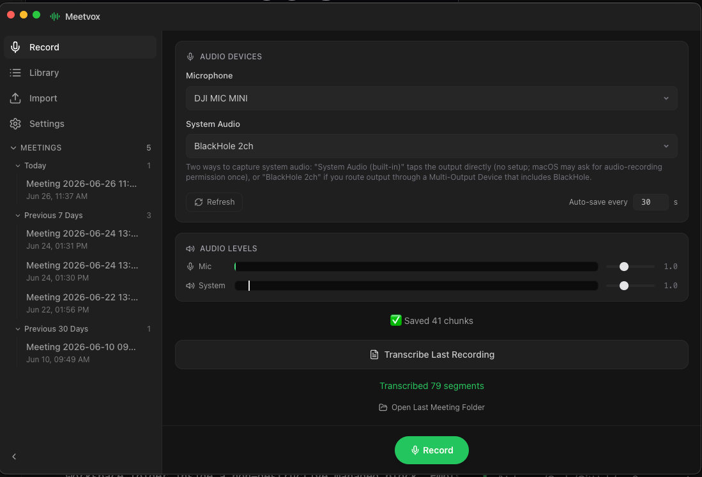

# Meetvox

Record a meeting and get a transcript that already knows who said what, without sending your audio anywhere.



Meetvox is a desktop app for macOS and Windows that records both sides of a conversation, your microphone and the audio coming out of your computer, then transcribes them on your own machine with a bundled build of [whisper.cpp](https://github.com/ggerganov/whisper.cpp). Nothing is uploaded. There is no Python and no cloud service in the recording or transcription path.

The trick to the speaker labels is simple. Your mic is recorded on the left channel, the system output (everyone else on the call) on the right. Each channel is transcribed on its own, so the left side becomes **You** and the right side becomes **Other**. No diarization model, no guessing, just a clean split of two audio sources you already have.

## What it does

- Records your mic and the system audio as separate channels, so the transcript is speaker-attributed by construction.
- Transcribes locally with whisper.cpp. Your audio, transcripts, and notes never leave the machine.
- Captures system audio on macOS through a Core Audio process tap, so there is no virtual audio driver to install. macOS asks for System Audio Recording permission once.
- Captures system audio on Windows through WASAPI loopback, or a virtual cable like VB-Cable for the most reliable path.
- Keeps a library of past meetings with an audio player that follows along with the transcript.
- Lets you take notes per meeting in a built-in editor.
- Imports an existing audio file and transcribes it.
- Generates an optional AI summary through your own Claude, Codex, or OpenAI account. This is off by default and is the only feature that ever sends text off the machine.
- Lives in the menu bar / tray so you can start and stop without hunting for the window.

## How recording works

Both platforms record 30-second stereo WAV chunks at 44.1 kHz: left channel is the mic, right channel is the system output. When you stop, each channel is split out, normalized, run through whisper.cpp, and merged back into a single timeline of `[time] Speaker: text` lines.

**macOS.** System audio is captured with a Core Audio process tap through a small Swift helper (`meetvox-syscap`) on macOS 14.4 and later. No BlackHole, no Multi-Output Device. The first recording triggers the System Audio Recording permission prompt; after you grant it, it is plug and play. On older macOS, route your output through a Multi-Output Device that includes a BlackHole virtual cable and select that as the system source instead.

**Windows.** System audio comes from a WASAPI render endpoint captured as a loopback input, or from a virtual cable. The virtual cable route (install [VB-Cable](https://vb-audio.com/Cable/), set it as the default output, pick `CABLE Output` as System Audio in the app) is the recommended path because it captures reliably on every build. See [resources/win-x64/README.md](resources/win-x64/README.md) for the details.

The microphone is captured with [naudiodon2](https://www.npmjs.com/package/naudiodon2) (PortAudio) on both platforms.

## Privacy

Everything is local by default. Recording, transcription, notes, and the meeting library all stay on disk.

The single exception is the AI summary feature. It is disabled until you enable a provider and add a credential in Settings, and the UI shows a note before you turn on anything that uses the network. API keys are stored in the operating system's secure vault (`safeStorage`), used only in a request header, and never written to a log or a URL.

## Requirements

- Node.js LTS
- macOS 14.4 or later for the no-driver capture path (earlier macOS falls back to a BlackHole virtual cable)
- Windows 10 or 11, x64

The transcription model (`ggml-large-v3-q5_0.bin`, about 1.08 GB) is not bundled. It downloads on the first transcription to `~/.meetvox/models/` on macOS or `%USERPROFILE%\.meetvox\models\` on Windows.

## Run it (development)

### macOS

```bash
npm install
npm run rebuild      # rebuild naudiodon2 against Electron's ABI
npm run dev
```

To capture system audio you also need the Swift helper built:

```bash
npm run pack:syscap  # builds meetvox-syscap into resources/mac-*/
```

### Windows

From the repo root in PowerShell:

```powershell
powershell -ExecutionPolicy Bypass -File .\setup-win.ps1 -FetchBinaries
npm run dev
```

The setup script installs dependencies, rebuilds the native audio addon for Electron, and downloads `whisper-cli.exe` and `ffmpeg.exe` into `resources/win-x64/`. Drop `-FetchBinaries` to only check what is missing.

## Build a packaged app

The two large binaries Meetvox spawns, `whisper-cli` and `ffmpeg`, are not committed (they are too big and platform-specific). Put a build of each into the matching `resources/<platform>/` folder first. [resources/README.md](resources/README.md) explains how to obtain or compile them.

```bash
npm run pack:syscap   # macOS only: build the system-audio capture helper
npm run dist:mac      # DMG
npm run dist:win      # NSIS installer
```

## Other commands

```bash
npm test         # unit tests (audio encoding, transcript formatting, device logic, summaries)
npm run typecheck
```

## Output layout

A finished meeting is a self-contained folder under the app's user-data directory:

```
recordings/meeting_YYYYMMDD_HHMMSS/
├── chunk_001.wav     # stereo: L = mic, R = system, 44.1 kHz int16
├── transcript.txt    # [HH:MM:SS] Speaker:\n text
├── transcript.json   # [{ time, speaker, text }, ...]
└── summary.json      # only if you generated an AI summary
```

## Stack

| Concern | Choice |
|---|---|
| Shell | Electron (electron-vite) |
| UI | React + Tailwind CSS |
| Mic capture | naudiodon2 (PortAudio) |
| System audio (macOS) | Core Audio process tap via the `meetvox-syscap` Swift helper |
| System audio (Windows) | WASAPI loopback via naudiodon2 |
| Transcription | bundled whisper.cpp (`whisper-cli`) |
| Audio processing | bundled static `ffmpeg` |
| AI summaries (optional) | Claude Code CLI, Codex CLI, Claude API, or any OpenAI-compatible API |
| Packaging | electron-builder (DMG / NSIS) |

## Project status

The recording, transcription, library, notes, import, and summary features are built and covered by unit tests. The macOS capture path is the most exercised. The roughest edge is Windows system audio: `naudiodon2` does not expose PortAudio's loopback flag, so plain render-endpoint capture can come up silent on some machines, and the VB-Cable route is the dependable workaround. On-device validation of live dual capture, packaging, and code signing is still in progress.

## License

MIT. See [LICENSE](LICENSE).
